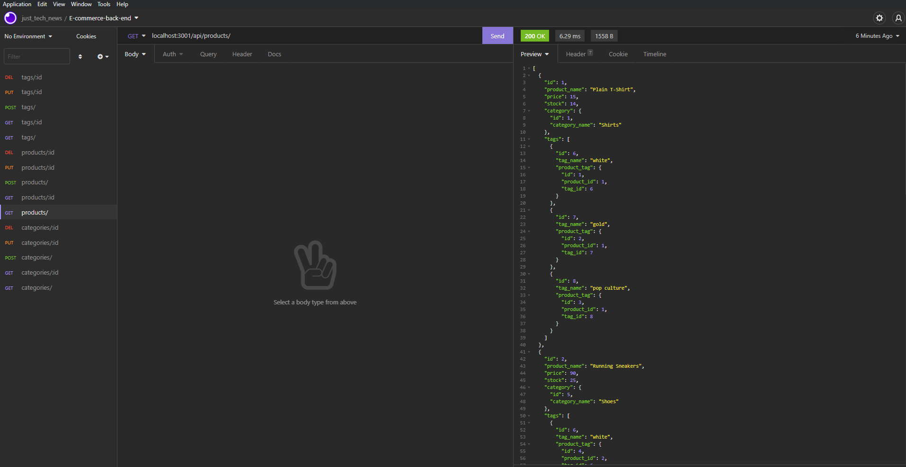

 </a>

<h3 align="center">E-Commerce Back End</h3>

---

      

## 

- [About](#about)
- [Installing](#installing)
- [Usage](#usage)
- [Built With](#built_using)
- [Authors](#authors)
- [Questions](#questions)
- [Screenshots](#screenshots)

## 

E-Commerce Back End is an assignment to demonstrate knowledge of MySQL, Sequelize, and Express.js and communicating information from the database to the front end.

## 

1. Clone repository from GitHub.
2. Create a .env file and enter your MySQL credentials.
3. Run the command: npm install.
4. Start MySQL and run command: source db/schema.sql. Exit MySQL.
5. Seed the database by running the command: npm run seed.
6. Start the server by running the command: npm start.
7. Open Insomnia and begin testing routes.

## 

E-Commerce Back End is not a full stack application and the routes must be run through Insomnia.

## 

- Express.js
- MySQL
- Sequelize
- Node.js
- Javascript

## 

- [glenluersman](https://github.com/glenluersman)

## 

- Feel free to open an issue or contact me directly at glen.luersman@gmail.com if you have any questions about the repo. You can find more of my work at [glenluersman](https://github.com/glenluersman/).

## 

Screencastify Video Link:
https://watch.screencastify.com/v/MIcel8PAgROLwQ9ZRiqq

</a>

</a>
